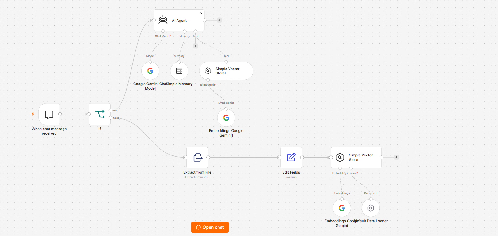
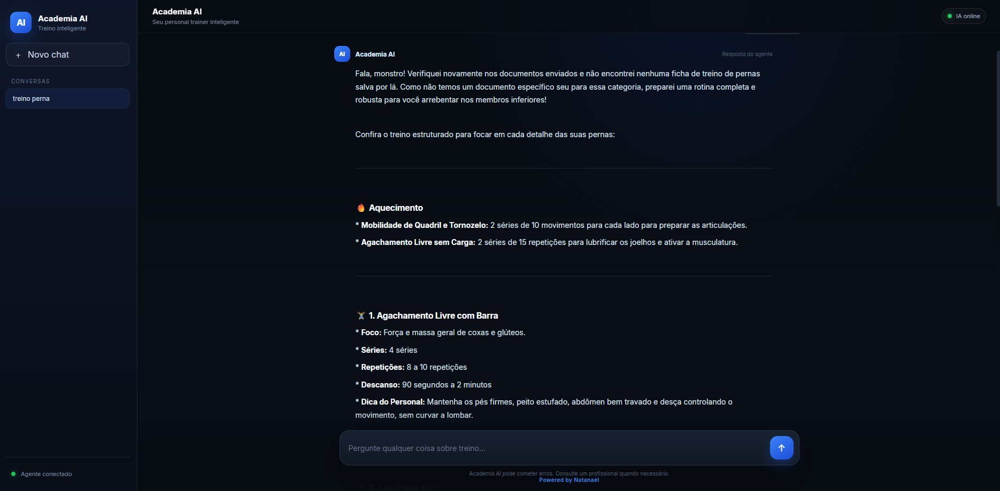

# Academia AI

Academia AI é uma aplicação web que utiliza inteligência artificial para auxiliar na criação e organização de treinos.

O projeto possui uma interface própria desenvolvida em Python com Flask, responsável pela interação com o usuário. As mensagens são encaminhadas para um workflow desenvolvido no n8n, onde são processadas pelo agente de inteligência artificial integrado ao Google Gemini.

O projeto foi desenvolvido como parte do Challenge Agente de IA do programa Tech Builder ONE, da Alura em parceria com a Oracle.

---

## Funcionalidades

A aplicação permite:

- Conversar com o agente utilizando linguagem natural.
- Solicitar sugestões de treinos.
- Criar treinos para diferentes grupos musculares.
- Solicitar treinos de acordo com objetivos específicos.
- Receber informações sobre séries, repetições e intervalos.
- Obter orientações sobre execução de exercícios.
- Manter contexto durante a conversa.
- Consultar informações armazenadas na base de conhecimento do agente.

---

## Arquitetura

O projeto é dividido em duas partes principais: a aplicação web e o agente de inteligência artificial.

A aplicação web recebe a mensagem enviada pelo usuário e realiza uma requisição para o webhook do n8n.

O n8n é responsável pela orquestração do agente e pela comunicação com o modelo de linguagem.

Fluxo simplificado:

```text
Usuário
   |
   v
Interface Web
Flask / Python
   |
   v
Webhook
   |
   v
n8n
   |
   v
AI Agent
   |
   +---- Google Gemini
   |
   +---- Memória
   |
   +---- Base de conhecimento
   |
   v
Resposta
   |
   v
Interface Web
```

### Workflow no n8n

O workflow do n8n contém a lógica utilizada pelo agente para receber as solicitações, consultar as ferramentas disponíveis e gerar as respostas.



---

## Demonstração

### Interface da aplicação

A Academia AI possui uma interface web própria para interação com o agente.



### Agente em funcionamento

Exemplo de interação com o agente através da aplicação publicada.


---

## Tecnologias utilizadas

As principais tecnologias utilizadas no desenvolvimento foram:

- Python
- Flask
- HTML
- CSS
- JavaScript
- n8n
- Google Gemini
- Git
- GitHub
- Render
- Visual Studio Code

---

## Estrutura do projeto

```text
academia-ia/
|
|-- docs/
|
|-- n8n/
|   |-- academia-ai.json
|
|-- screenshots/
|
|-- app.py
|-- requirements.txt
|-- .env.example
|-- .gitignore
|-- README.md
```

O arquivo `app.py` contém a aplicação Flask e a interface utilizada pelo usuário.

O diretório `n8n` contém uma versão exportada do workflow utilizado pelo agente.

---

## Comunicação com o n8n

A aplicação utiliza uma variável de ambiente chamada:

```text
N8N_WEBHOOK_URL
```

Essa variável contém o endereço do webhook responsável pela comunicação entre a aplicação Flask e o workflow do n8n.

As credenciais e endereços sensíveis não são armazenados diretamente no código-fonte.

---

## Executando o projeto localmente

### Requisitos

Antes de executar o projeto é necessário possuir:

- Python instalado.
- Uma instância do n8n configurada.
- Credenciais válidas para os serviços utilizados pelo workflow.

### Clonar o repositório

```bash
git clone https://github.com/natunhaku/academia-ai.git
```

Entre no diretório:

```bash
cd academia-ai
```

### Instalar as dependências

```bash
pip install -r requirements.txt
```

### Configurar o webhook

Configure a variável de ambiente `N8N_WEBHOOK_URL` com o endereço do webhook de produção do n8n.

Exemplo:

```text
N8N_WEBHOOK_URL=https://seu-dominio-n8n.onrender.com/webhook/academia-ai
```

### Executar a aplicação

```bash
python app.py
```

Após iniciar o servidor, a aplicação poderá ser acessada pelo endereço local informado no terminal.

---

## Deploy

A aplicação foi publicada utilizando o Render.

Versão pública:

https://academia-ai-vusz.onrender.com

A interface web se comunica com o serviço do n8n por meio do webhook configurado no ambiente de produção.

Como a aplicação utiliza infraestrutura gratuita, o primeiro acesso após um período de inatividade pode apresentar um tempo maior de inicialização.

---

## Exemplos de uso

Algumas solicitações que podem ser feitas ao agente:

```text
Monte um treino de peito para hipertrofia.
```

```text
Crie um treino de pernas focado em quadríceps.
```

```text
Monte um treino para fazer em casa.
```

```text
Como executar corretamente o supino com halteres?
```

```text
Quero ganhar massa muscular. Como posso organizar meu treino?
```

O agente interpreta a solicitação e retorna uma resposta com informações relacionadas ao treino solicitado.

---

## Segurança

Credenciais e chaves de API não são incluídas diretamente no repositório.

As informações sensíveis utilizadas pelo projeto são configuradas por meio de variáveis de ambiente ou pelo sistema de credenciais do n8n.

O arquivo `.env` não deve ser enviado para o repositório.

---

## Autor

Natanael Barbosa de Sousa

Projeto desenvolvido para o Challenge Agente de IA do programa Tech Builder ONE - Alura + Oracle.

Powered by Natanael
